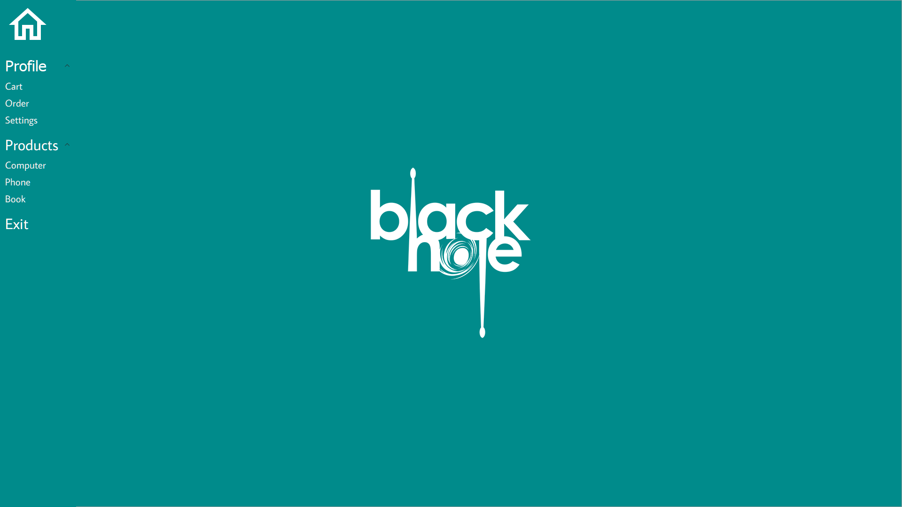
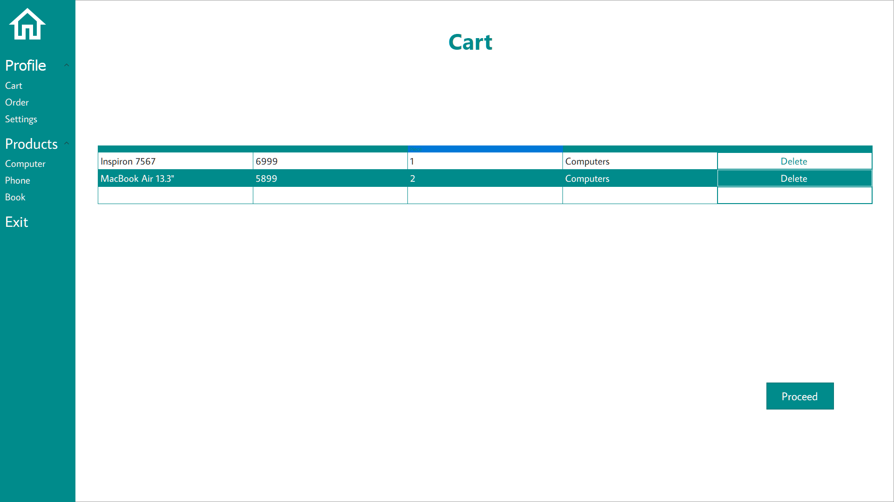
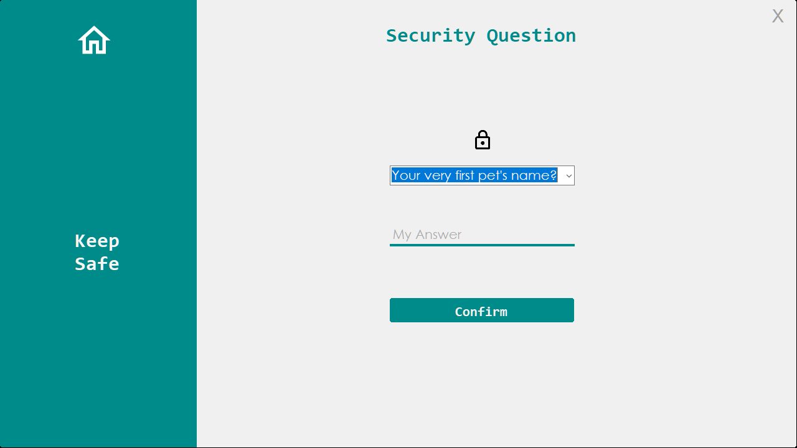
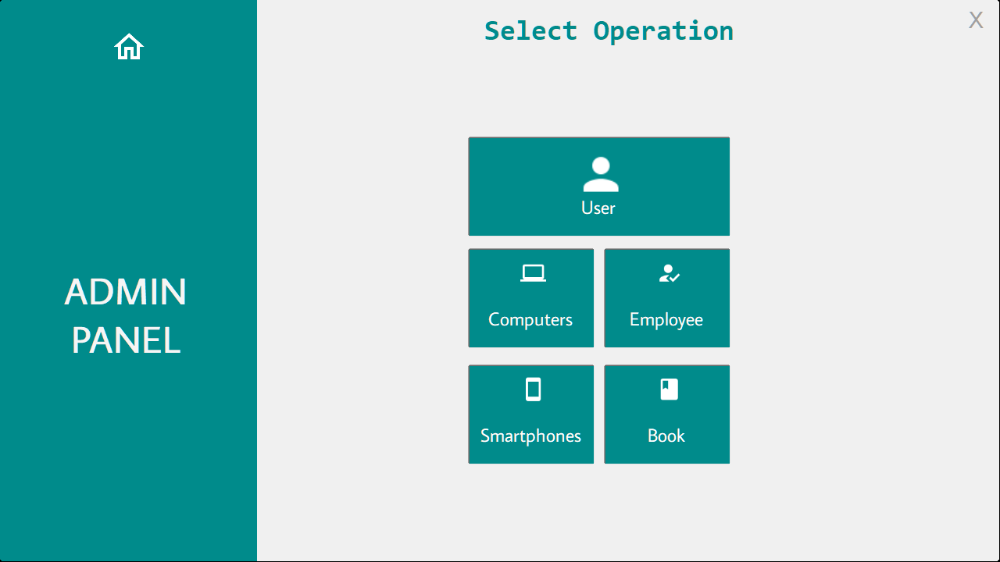

# Blackhole

Blackhole is a technology market management system programmed on Visual Studio with C # programming language. A management system that allows the shopping center based on technology to perform both user and administrator operations.

In the C # project competition organized under the Visual Programming course of the Software Engineering and Computer Engineering students of Istanbul Sabahattin Zaim University, where students can participate individually or as a group, I have developed  "Blackhole" by myself. This project was ranked 3rd.

Note : To enter admin panel, you need to login with "admin" and "admin".
Note : The "blackhole" logo do not belong to me.
